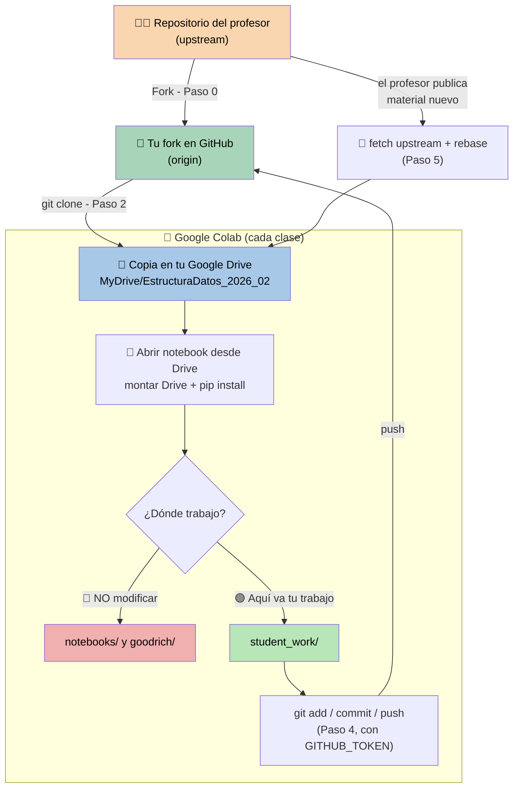

# 📘 Guía de uso con Google Colab

Esta guía es una **alternativa a GitHub Codespaces** para quienes no puedan
desplegar Codespaces desde la red o el equipo de la universidad. El flujo de
trabajo (fork, `student_work/`, actualizaciones del profesor) es el mismo
descrito en el [README.md](README.md) principal, pero adaptado para que todo
ocurra dentro de Google Colab en lugar de un contenedor en la nube.

> ⚠️ Requisito: este repositorio debe estar **público** en GitHub para poder
> clonarlo desde Colab sin necesidad de token. El token (guardado como
> Secret de Colab, ver Paso 1) solo se usa para **guardar tu trabajo**
> (`push`), ya que GitHub siempre exige autenticación para escribir.

---

# 🍴 Paso 0: hacer un Fork (obligatorio)

Igual que con Codespaces:

1. Entra al repositorio del curso en GitHub.
2. Haz clic en **Fork** (arriba a la derecha).
3. Se creará una copia en **tu cuenta personal de GitHub**.

👉 A partir de ahora trabajarás siempre sobre **tu propio fork**, nunca sobre
el repositorio del profesor.

---

# 🔑 Paso 1: crear tu Personal Access Token (PAT)

Necesitas un token para poder **guardar (`push`)** tu trabajo desde Colab
hacia tu fork. Solo se hace una vez por semestre (o cuando expire):

1. En GitHub, ve a **Settings → Developer settings → Personal access tokens
   → Fine-grained tokens → Generate new token**.
2. **Repository access:** selecciona *Only select repositories* → tu fork
   (ej. `tu_usuario/EstructuraDatos_2026_02`).
3. **Permissions → Repository permissions → Contents:** `Read and write`.
4. **Expiration:** elige algo cómodo para el semestre (ej. 90 días).
5. Genera el token y **cópialo**. GitHub solo lo muestra una vez.

## Guardar el token en los Secrets de Colab

En vez de pegar el token cada vez, guárdalo una sola vez en los **Secrets**
de Colab (el ícono de llave 🔑 en la barra lateral izquierda):

1. Abre cualquier cuaderno en [colab.research.google.com](https://colab.research.google.com/).
2. Haz clic en el ícono de **llave (🔑 Secrets)** en la barra lateral
   izquierda.
3. Haz clic en **+ Añadir un secreto nuevo**.
4. **Nombre:** `GITHUB_TOKEN` — **Valor:** pega tu token.
5. Activa el interruptor **Acceso al notebook** para que el cuaderno actual
   pueda leerlo.

🔒 Los Secrets se guardan cifrados en tu cuenta de Google y **no** viajan
dentro del `.ipynb` ni se suben a GitHub, así que es seguro dejarlos
configurados de forma permanente. Cada vez que abras un notebook nuevo
tendrás que volver a activar el interruptor de acceso para ese notebook (es
una medida de seguridad de Colab).

---

# 🚀 Paso 2: configuración inicial (una sola vez)

Abre [colab.research.google.com](https://colab.research.google.com/),
crea un cuaderno nuevo y ejecuta estas celdas **una sola vez** para clonar
tu fork dentro de tu Google Drive (así tu copia persiste entre sesiones,
en vez de perderse cada vez que Colab reinicia la máquina):

**Celda 1 — Montar Google Drive**

```python
from google.colab import drive
drive.mount('/content/drive')
```

**Celda 2 — Clonar tu fork en Drive**

Como el repositorio es público, el `clone` no necesita token (solo lo
necesitarás más adelante para el `push`, Pasos 4 y 5):

```python
usuario_github = "TU_USUARIO"   # cámbialo por tu usuario de GitHub
repo = "EstructuraDatos_2026_02"

%cd /content/drive/MyDrive
!git clone https://github.com/{usuario_github}/{repo}.git
%cd {repo}
!git submodule update --init
!git config merge.ours.driver true
!git remote add upstream https://github.com/arleyfernandotorresgalindo/EstructuraDatos_2026_02.git
```

Esto deja en tu Drive la carpeta `MyDrive/EstructuraDatos_2026_02` con:

```
.
├── goodrich/        # Código fuente del libro (NO modificar)
├── notebooks/       # Notebooks de clase con teoría (NO modificar)
└── student_work/    # ← TU TRABAJO VA AQUÍ
```

`git config merge.ours.driver true` evita conflictos cuando el profesor
actualiza los notebooks del curso, igual que en Codespaces.

---

# 📓 Paso 3: trabajar cada clase

Cada vez que abras Colab para trabajar en el curso:

1. Ve a **Archivo → Abrir cuaderno → Google Drive** y navega hasta
   `MyDrive/EstructuraDatos_2026_02/notebooks/...` para abrir el `.ipynb`
   directamente desde tu Drive (así los cambios se autoguardan ahí, no en
   una copia suelta de Colab).
2. En la **primera celda** del notebook, monta Drive e instala las
   dependencias (Colab reinicia la máquina en cada sesión, así que los
   paquetes deben reinstalarse, pero los archivos en Drive sí persisten):

```python
from google.colab import drive
drive.mount('/content/drive')

%cd /content/drive/MyDrive/EstructuraDatos_2026_02
!pip install -q -r requirements.txt

import sys
sys.path.append('/content/drive/MyDrive/EstructuraDatos_2026_02')
```

3. Trabaja normalmente en las celdas del notebook.

---

# ⚠️ Reglas importantes

🔴 **NO modifiques:**

- `goodrich/`
- `notebooks/`

🟢 **Trabaja únicamente en:**

```
student_work/
```

El profesor **nunca** modifica esa carpeta. Tu trabajo ahí está siempre
seguro, incluso cuando actualices el contenido del curso.

---

# 💾 Paso 4: guardar tu trabajo (push)

Como Colab no guarda tu sesión de GitHub como Codespaces, cada `push`
necesita el token. Al ejecutar esta celda, Colab te pedirá permiso para
leer el secret `GITHUB_TOKEN` la primera vez en cada notebook — acéptalo.
Ejecuta esto al final de tu sesión de trabajo (o cuando quieras respaldar
avances):

```python
from google.colab import userdata

usuario_github = "TU_USUARIO"
repo = "EstructuraDatos_2026_02"
token = userdata.get('GITHUB_TOKEN').strip()

%cd /content/drive/MyDrive/{repo}
!git config --global user.email "tu_correo@ejemplo.com"
!git config --global user.name "Tu Nombre"
!git add student_work/
!git commit -m "descripción de lo que hice"
!git push https://{token}@github.com/{usuario_github}/{repo}.git main
```

> ⚠️ Si el `git commit` falla con `Author identity unknown`, es porque
> Colab reinicia la máquina en cada sesión y esa configuración se pierde.
> Vuelve a ejecutar las dos líneas de `git config --global` de arriba.

> ⚠️ Si el `push` falla con `unable to access '...': URL using bad/illegal
> format` y el error se parte en dos líneas de bash, el token guardado en
> el Secret `GITHUB_TOKEN` probablemente tiene un salto de línea o espacio
> de más al final (por copiar y pegar). El `.strip()` en `userdata.get(...)`
> lo soluciona; si sigue fallando, borra el secret y vuelve a pegarlo con
> cuidado de no incluir espacios ni saltos de línea extra.

El token se lee directamente desde los Secrets de Colab: nunca queda escrito
en el notebook ni en `.git/config`, y no tienes que volver a pegarlo a mano.

---

# 🔄 Paso 5: actualizar el contenido del curso

Cuando el profesor publique material nuevo (nuevos notebooks, correcciones,
etc.), trae esos cambios a tu fork con:

```python
from google.colab import userdata

usuario_github = "TU_USUARIO"
repo = "EstructuraDatos_2026_02"
token = userdata.get('GITHUB_TOKEN')

%cd /content/drive/MyDrive/{repo}
!git fetch upstream
!git rebase upstream/main
!git submodule update
!git push https://{token}@github.com/{usuario_github}/{repo}.git main --force
```

👆 Esto actualiza tu copia en Drive con el material nuevo del profesor sin
perder tu trabajo en `student_work/`.

---

# ❓ Problemas comunes

### "fatal: could not read Username" al hacer push

El token expiró o no coincide con la URL. Genera uno nuevo (Paso 1),
actualiza el secret `GITHUB_TOKEN` en Colab con el valor nuevo y vuelve a
ejecutar la celda.

### `SecretNotFoundError` o Colab pide autorizar el secret

- Si dice que `GITHUB_TOKEN` no existe: vuelve al ícono de llave 🔑 y créalo
  siguiendo el Paso 1.
- Si aparece un aviso pidiendo autorizar el acceso al notebook: haz clic en
  **Otorgar acceso**. Colab pide esto una vez por cada notebook nuevo, es
  normal.

### `/content/drive/MyDrive/...` no existe

No montaste Google Drive en esa sesión. Ejecuta de nuevo la celda con
`drive.mount('/content/drive')` y autoriza el acceso cuando Colab lo pida.

### La carpeta `goodrich/` aparece vacía

El submódulo no se inicializó. Ejecuta:

```python
%cd /content/drive/MyDrive/EstructuraDatos_2026_02
!git submodule update --init
```

### No aparecen cambios del profesor / error al hacer rebase

Si tienes cambios locales sin guardar en `notebooks/` o `goodrich/`
(no deberías, pero por si acaso):

```python
!git stash
!git fetch upstream
!git rebase upstream/main
!git submodule update
!git stash pop
```

Luego vuelve a hacer el `push --force` del Paso 5.

### Error de importación de `goodrich` (`ModuleNotFoundError`)

Verifica que ejecutaste la línea `sys.path.append(...)` del Paso 3 en la
primera celda del notebook, apuntando a la ruta correcta dentro de tu
Drive.

---

# 🗺️ Diagrama del flujo completo



**Cómo leerlo:**
- **Naranja** → repo del profesor, solo lectura (nunca haces push ahí directamente).
- **Verde (fork)** → tu copia en GitHub, a donde SÍ subes tu trabajo.
- **Azul** → tu copia local en Google Drive, donde vive todo mientras trabajas en Colab.
- **Rojo** dentro de Colab → carpetas prohibidas de modificar.
- **Verde claro** dentro de Colab → única carpeta donde debes trabajar (`student_work/`).
- Las flechas de vuelta (`fetch upstream` → `rebase`) son cómo traes actualizaciones del profesor sin perder tu trabajo.

---

# 🔁 Flujo de trabajo recomendado

1. Monta Drive y abre el notebook de la clase directamente desde Drive.
2. Instala dependencias y ajusta `sys.path` (celda inicial).
3. Revisa la teoría en `notebooks/` y resuelve en `student_work/`.
4. Guarda tu trabajo con `git add` / `commit` / `push` (Paso 4, idealmente
   desde un notebook aparte fuera de `student_work/` — ver nota de
   seguridad del Paso 4).
5. Antes de cada clase nueva, trae las actualizaciones del profesor
   (Paso 5).

---

# 👨‍🏫 Autor

Curso diseñado por **Arley Fernando Torres Galindo**.
